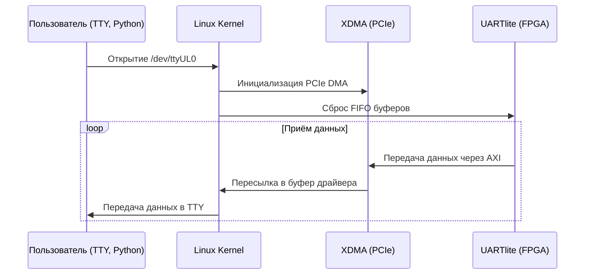

# Разработка драйвера UartLite подключеного через XDMA (PCIe) на пользовательской SDR-плате (прокидываем AXI устройства в Linux через PCIe)

## Аннотация

Этот проект демонстрирует, как подключить периферийное устройство UARTLite на базе FPGA к пользовательским приложениям Linux через **PCIe** **XDMA**.  
Реализуем **TTY-интерфейс** (драйвер **Linux TTY** ) `/dev/ttyULx` и показываем альтернативный способ быстрого доступа через **Python** с использованием `mmap`.  
Идеально подходит для интеграции в проекты **SDR**, робототехники и встраиваемых систем!

- **Что за устройство?**  
  ➔ Наша SDR-плата на **FPGA Artix-7**, **GPS SIM68** модулем и **AD9361** RF рансивером, интерфейсом PCIe и возможностью обмена данными между **FPGA** и **Linux** через **XDMA**.

- **Что мы будем делать?**  
  ➔ Разработаем Linux-драйвер для UARTLite через XDMA и продемонстрируем альтернативный способ прямого доступа через Python.

- **Почему это важно?**  
  ➔ Такое решение позволяет легко интегрировать пользовательские FPGA-периферии в Linux-системы без сложной ручной настройки, особенно в SDR-проектах, робототехнике, автономных системах и IoT.

---

## 1. Введение

Встраиваемые системы на базе **FPGA** широко применяются в программно-определяемых радиосистемах (**SDR**, Software-Defined Radio). 
Программно-определяемые радиосистемы (SDR) требуют эффективного взаимодействия между FPGA и CPU, что осложняется интеграцией периферии через PCIe. Эта статья решает задачу разработки драйвера для UARTlite через XDMA, демонстрируя два подхода: через ядро Linux и Python. Цель — показать архитектуру, реализацию и тестирование решения на базе собственной SDR-платы. Задачи включают описание архитектуры системы, процесса разработки драйвера и методов тестирования.

**Особенности проекта:**  
✅ **Разработанная с нуля SDR-плата** на **FPGA Artix-7 и AD9361**  
✅ **В качестве системной платы** используется **[Latte Panda Sigma]([LattePanda Sigma - x86 Windows Single Board Computer Server](https://www.lattepanda.com/lattepanda-sigma))**
✅ **Встроенный UARTlite** для взаимодействия с GPS модулем подключеным к FPGA 
✅ **XDMA через PCIe** для высокоскоростной передачи данных  
✅ **Поддержка двух методов работы:**  

- **Linux-драйвер с TTY-интерфейсом** (`/dev/ttyULx`)  
- **Прямая работа с UARTlite на Python через XDMA**  

---

## 2. Архитектура решения

### 2.0 Описание платы и подключений

Проект основан на разработанной с нуля SDR-плате с FPGA и интерфейсом PCIe: 


**Основная платформа проекта:**

| Компонент              | Описание                                                        |
| ---------------------- | --------------------------------------------------------------- |
| **FPGA**               | Xilinx Artix-7 (XC7A200T)                                       |
| **RF-трансивер**       | Analog Devices AD9361 (70 MHz – 6 GHz)                          |
| **GPS-модуль**         | SIM68 (NMEA 0183 Output)                                        |
| **DDR**                | MT41K256M16HA-125 AAT                                           |
| **Хост-плата**         | [LattePanda Sigma](https://www.lattepanda.com/lattepanda-sigma) |
| **Интерфейс передачи** | PCIe Gen1 x4 (10 Gbps через разъём M.2)                         |
| **Передача данных**    | Через XDMA и AXI шину                                           |
| **UART-периферия**     | AXI UARTLite IP Core (9600 бод)                                 |
| **Форм-фактор**        | M.2 2280 (80mm × 22mm)                                          |

### 2.1 Структурная схема системы

На изображении ниже представлена структурная схема системы с SIM68, UARTlite и XDMA:


данные проходят по цепочке:

1. **SIM68** передает [NMEA]([NMEA-0183 messages: Overview](https://receiverhelp.trimble.com/alloy-gnss/en-us/NMEA-0183messages_MessageOverview.html))-сообщения в **UartLite** на FPGA через **UART**
2. **UartLite** взаимодействует с **XDMA (PCIe DMA)** через **AXI**.
3. **XDMA** передаёт данные через **PCIe** в **CPU (Latte Panda Sigma)**.
4. **CPU** обрабатывает данные в **user-space** и взаимодействует с **ядром Linux**.
5. **Linux Kernel** предоставляет интерфейс **TTY / Python API** для **пользовательского приложения** (`/dev/ttyUL0`).
6. **User Application** – взаимодействует с UART через Python или терминал.

На изображении ниже представлена структурная схема системы с SIM68, UARTlite и XDMA при прямом доступе через Python:


<!-- или подставишь своё актуальное изображение для Python-потока -->

Данные проходят по цепочке:

1. **SIM68** передает [NMEA](https://receiverhelp.trimble.com/alloy-gnss/en-us/NMEA-0183messages_MessageOverview.html)-сообщения в **UartLite** на FPGA через **UART**.

2. **UartLite** взаимодействует с **XDMA (PCIe DMA)** через **AXI**.

3. **XDMA** передаёт данные через **PCIe** в **CPU (Latte Panda Sigma)**.

4. **CPU** через `/dev/xdma0_user` мапит пространство устройства с помощью **mmap**.

5. **Python Application** напрямую читает регистры UARTlite (RX FIFO / TX FIFO), минуя драйвер ядра.

**Таким образом**, взаимодействие происходит без использования стандартного Linux TTY-драйвера, что позволяет:

- Минимизировать накладные расходы на системные вызовы.

- Снизить нагрузку на процессор за счёт использования **async IO**.

- Быстро прототипировать и отлаживать системы на основе FPGA.

#### Описание системы

Система состоит из следующих компонентов и их связей:

1. **SIM68 (GPS Module)**
   
   - Это GPS-модуль, который отправляет данные через интерфейс UART.
   - Связан с **UartLite (UART Controller)** через **UART**.

2. **UartLite (UART Controller)**
   
   - Контроллер UART, принимающий данные от GPS-модуля.
   
   - Связан с **XDMA (PCIe DMA)** через шину **AXI**.
     
     [AXI UARTLite Product Guide (PG142)]([AMD Technical Information Portal](https://docs.amd.com/v/u/en-US/pg142-axi-uartlite))
     
     [AXI Interconnect Product Guide (PG059)]([AMD Technical Information Portal](https://docs.amd.com/r/en-US/pg059-axi-interconnect))

3. **XDMA (PCIe DMA)**
   
   - Контроллер прямого доступа к памяти (DMA) через PCIe.
     
     [AXI PCIe DMA Product Guide (PG195)]([AMD Technical Information Portal](https://docs.amd.com/r/en-US/pg195-pcie-dma))
   
   - Связан с **CPU (Latte Panda Sigma)** через **PCIe**.

4. **CPU (Latte Panda Sigma)**
   
   - Центральный процессор, который обрабатывает данные от XDMA.
   - Связан с **Linux Kernel** через обозначение **User-space** (пространство пользователя).

5. **Linux Kernel**
   
   - Ядро операционной системы Linux, работающее на CPU.
   
   - Связан с **User Application** через интерфейсы **TTY / Python**.
     
     [Linux TTY Documentation]([TTY &#8212; The Linux Kernel documentation](https://docs.kernel.org/driver-api/tty/index.html))

6. **User Application**
   
   - Пользовательское приложение, которое взаимодействует с ядром Linux для доступа к данным, возможно, через TTY-устройства или скрипты на Python.

Показывает, как драйвер управляет UARTlite.



### 2.2 Блок-схема в Vivado

- В проекте используется **XDMA (PCIe-DMA Bridge)**

- AXI Interconnect связывает **XDMA** с **AXI Register Slice**,  **AXI UARTLite**

- **AXI UARTLite подключен к системе через AXI Interconnect**

- Есть также **AXI GPIO**, которые могут использоваться для управления
  
  *

**Основной поток данных:**  
**FPGA** ↔ **AXI Interconnect** ↔ **AXI UARTLite** ↔ **PCIe XDMA** ↔ **CPU/Linux**

Ниже представлен скрин проекта в Vivado:


или простая реализация только для UartLite:


### 2.3 Разбор конфигурации XDMA и UartLite:


#### AXI UARTLite (Настройки IP)

- **Частота AXI CLK:** `62.5 МГц`
- **Скорость UART:** `9600 бод`
- **Длина данных:** `8 бит`
- **Четность (Parity):** `Отключена (No Parity)`

Эти настройки стандартные для UARTLite, но если необходимо **увеличить скорость** передачи, можно выставить `115200 бод`.


#### Настройки DMA (PCIe : DMA)

 [AXI PCIe DMA Product Guide (PG195)]([AMD Technical Information Portal](https://docs.amd.com/r/en-US/pg195-pcie-dma))

**Количество каналов**

- **1 канал на чтение (H2C)**

- **1 канал на запись (C2H)**

- Количество **Request IDs**: 32 (чтение), 16 (запись)

- **AXI ID Width**: 4 (идентификатор транзакций в AXI)
  
  **Descriptor Bypass (Отключен)**

- Используется стандартное управление буферами (без байпаса).

#### Настройки прерываний (PCIe : MISC)

 **Количество прерываний:** 16  
 **MSI включен** (Message Signaled Interrupts)  
 **Расширенные теги включены** (Extended Tag Field)

#### Настройки BAR (PCIe : BARS)

 **PCIe → AXI Lite Master Interface**

- **Размер памяти:** 1MB
- **Адрес:** `0x00000000`  
   **PCIe → DMA Interface** включен

#### Идентификаторы устройства (PCIe ID)

 **Vendor ID:** `10EE` (Xilinx)  
 **Device ID:** `7011`  
 **Class Code:** `120000` (устройство памяти)

#### Базовые настройки PCIe (Basic)

[PCIe Base Specification (official summary)]([Specifications | PCI-SIG](https://pcisig.com/specifications))

 **PCIe x1, 2.5 GT/s**  
 **AXI Address Width: 64-bit**  
 **AXI Data Width: 64-bit**  
 **AXI Clock: 125 MHz**  
 **Режим: AXI Memory Mapped**

Адресс UartLite:


### 2.2 Подключение SDR к материнской плате

.jpeg)

---

## 3. Реализация драйвера

### 3.1 Подготовка окружения

**Аппаратная платформа:**  

- **SDR-плата:** разработанная мной, FPGA Artix-7 200T  
- **GPS-модуль:** SIM68  
- **Интерфейсы:** PCIe, UART  
- **Материнская плата**: Latte Panda Sigma

**Программное обеспечение:**  

- **ОС:** Linux Kernel 6.x+  
- **Инструменты:** Vivado, Python, GCC  
- **Отладка:** `dmesg`, `minicom`

---

### 3.2 Установка зависимостей

```shell
sudo apt-get update
sudo apt-get install -y build-essential dkms linux-headers-$(uname -r) git
sudo apt-get install -y pciutils lshw
sudo apt install -y gcc-13 g++-13 
sudo apt install -y gpsd gpsd-clients
```

**Что устанавливаем?**

- `build-essential` — инструменты сборки (`gcc`, `make`, `binutils`)
- `dkms` — динамическое управление модулями ядра
- `linux-headers-$(uname -r)` — заголовочные файлы текущего ядра
- `git` — для загрузки исходников драйвера XDMA
- `pciutils` (`lspci`) — просмотр PCIe-устройств
- `lshw` — детальная информация об оборудовании
- `gcc-13`, `g++-13` — компиляторы C и C++ версии 13
- `gpsd`, `gpsd-clients` — демоны и утилиты для работы с GPS-приёмниками

Проверка версии:

```shell
gcc-13 --version
```

### 3.3 Проверка оборудования

После установки  убедимся, что **PCIe-устройство (FPGA)** распознаётся системой:

```shell
lspci -d 10ee:
```

Если **XDMA-карта видна**, будет вывод типа:

```bash
59:00.0 Memory controller: Xilinx Corporation Device 7011
```

Вот что показывает у меня:

### 3.4 Реализация драйвера

#### Принцип работы драйвера

При загрузке модуля драйвер регистрирует **PCIe**-устройство с **Vendor ID**  `0x10EE` и **Device ID** `0x7011`. После инициализации он создаёт **TTY**-устройство `/dev/ttyUL0`. Входящие данные из **UARTlite** обрабатываются через механизм workqueue, передаются в буфер **TTY** и становятся доступны пользователю через функцию `tty_flip_buffer_push`.

[Linux TTY Documentation]([TTY &#8212; The Linux Kernel documentation](https://docs.kernel.org/driver-api/tty/index.html))

#### Определение констант

```c
#define DRIVER_NAME "uartlite_xdma" // Имя драйвера
#define VENDOR_ID 0x10EE  // Xilinx Vendor ID
#define DEVICE_ID 0x7011  // Device ID для FPGA Hard PCIe block
#define UARTLITE_BASE_OFFSET 0x40000 // Базовый адрес AXI**
```

- `VENDOR_ID = 0x10EE` — это **Xilinx** (задается в конфигурации IP ядра в Vivado, каждый производитель PCIe-устройств имеет свой ID).
- `DEVICE_ID = 0x7011` — **идентификатор устройства** (задается в конфигурации IP ядра в Vivado).
- `UARTLITE_BASE_OFFSET = 0x40000` — **смещение в памяти**, где находится UARTlite в пространстве XDMA (в моем прмере `0x40000` , орпеделяется проектом в Vivado)

#### Адреса регистров в памяти:

В соотвествии с datashhet AXI UartLite ([AXI UARTLite Product Guide (PG142)](([AMD Technical Information Portal](https://docs.amd.com/v/u/en-US/pg142-axi-uartlite))))

```c
#define UARTLITE_RX_FIFO  0x00  // FIFO приёма
#define UARTLITE_TX_FIFO  0x04  // FIFO передачи
#define UARTLITE_STATUS   0x08  // Регистр состояния
#define UARTLITE_CONTROL  0x0C  // Регистр управления
```

- **RX_FIFO (0x00)** — читаем данные, полученные от UART.
- **TX_FIFO (0x04)** — записываем данные для передачи.
- **STATUS (0x08)** — флаги состояния (данные есть? FIFO заполнен?).
- **CONTROL (0x0C)** — управление UARTlite.

#### Флаги регистра состояния

```c
#define STATUS_RXVALID    BIT(0) // Данные есть в RX FIFO
#define STATUS_TXFULL     BIT(3) // TX FIFO заполнен
```

- **RXVALID (бит 0)** — `1`, если в RX FIFO есть данные.
- **TXFULL (бит 3)** — `1`, если TX FIFO заполнен.

#### Основная структура данных

```c
struct uartlite_priv {
    void __iomem *base;
    struct tty_port port;
    struct work_struct rx_work; // Обработчик RX (workqueue)
    bool running;
};
```

**Структура `uartlite_priv` хранит:**

- `base` — **указатель на базовый адрес устройства** в PCIe.
- `port` — **TTY-порт** для связи с Linux.
- `rx_work` — **задача** для обработки входящих данных (workqueue).
- `running` — **флаг работы** (установлен, пока устройство активно).

#### Функции работы с UARTlite

```c
static int uartlite_tx_ready(struct uartlite_priv *priv)
{
    return !(ioread32(priv->base + UARTLITE_STATUS) & STATUS_TXFULL);
}
```

**Проверяет, можно ли передавать данные:**

- Читает `STATUS`
- Если `TXFULL == 0`, значит, можно передавать.

```c
static void uartlite_write_byte(struct uartlite_priv *priv, u8 val)
{
    iowrite32(val, priv->base + UARTLITE_TX_FIFO);
}
```

**Записывает 1 байт в TX FIFO**.

```c
static int uartlite_rx_ready(struct uartlite_priv *priv)
{
    return ioread32(priv->base + UARTLITE_STATUS) & STATUS_RXVALID;
}
```

**Проверяет, есть ли данные в RX FIFO.**

```c
static u8 uartlite_read_byte(struct uartlite_priv *priv)
{
    return ioread32(priv->base + UARTLITE_RX_FIFO);
}
```

**Считывает 1 байт из RX FIFO.**

#### Обработка приёма данных (RX)

В этом драйвере используется **поллинг RX FIFO** (приёмного буфера UARTlite) через **workqueue** , для упрощения реализации, что бы не использовать механизм работы через прерывания.

**Поллинг (polling)** — это метод обработки данных, при котором **процессор периодически проверяет состояние устройства** и считывает данные, если они доступны.

##### **Как работает поллинг в драйвере?**

**1. Приложение открывает TTY-устройство (`/dev/ttyUL0`)**

- Вызывается `uartlite_tty_open()`, который **устанавливает флаг `running = true`**.
- Запускается обработчик `uartlite_rx_work()` с помощью `schedule_work()`.

**2. Функция `uartlite_rx_work()` проверяет, есть ли данные в RX FIFO**

- **Читает регистр статуса (`UARTLITE_STATUS`)**.
- Если в `RX FIFO` есть данные (`STATUS_RXVALID` = `1`), читает и буферизует их и передаёт в TTY (`tty_flip_buffer_push`,`tty_insert_flip_string`).

**3. Если FIFO не пуст, данные передаются в TTY-подсистему**

- Вызываются:
  
  ```c
  tty_insert_flip_string(&priv->port, buf, count); 
  tty_flip_buffer_push(&priv->port);
  ```

- Данные становятся доступны в `/dev/ttyUL0`.

**4. После обработки данных обработчик `uartlite_rx_work()` самозапускается**

- **Если `running = true`**, функция **снова вызывается** (`schedule_work()`).
- **Если `running = false`**, процесс останавливается (например, после закрытия `/dev/ttyUL0`).

```c
static void uartlite_rx_work(struct work_struct *work)
{
  struct uartlite_priv *priv = container_of(work, struct uartlite_priv, rx_work);
    struct tty_struct *tty = tty_port_tty_get(&priv->port);
    unsigned char buf[16];
    int i, count;

    if (!tty)
        return;

    while (priv->running && uartlite_rx_ready(priv)) {
        count = 0;
        for (i = 0; i < sizeof(buf) && uartlite_rx_ready(priv); i++) {
            buf[i] = uartlite_read_byte(priv);
            count++;
        }
        if (count) {
            tty_insert_flip_string(&priv->port, buf, count);
            tty_flip_buffer_push(&priv->port);
        }
    }

    if (priv->running)
        schedule_work(&priv->rx_work);

    tty_kref_put(tty);
}
```

#### Регистрация PCIe-устройства

Регистрирует PCIe-драйвер следующая функция:

```c
static struct pci_driver uartlite_pci_driver = {
    .name = DRIVER_NAME,
    .id_table = uartlite_pci_tbl,
    .probe = uartlite_probe,
    .remove = uartlite_remove,
};
```

- При обнаружении устройства → **вызов `uartlite_probe()`**
- При удалении устройства → **вызов `uartlite_remove()`**

Код ниже определяет **таблицу идентификаторов PCI-устройств**, которые поддерживает драйвер.

```c
static const struct pci_device_id uartlite_pci_tbl[] = {
    { PCI_DEVICE(VENDOR_ID, DEVICE_ID) },
    { 0, }
};
```

- **`static const struct pci_device_id uartlite_pci_tbl[]`**
  
  - Определяет **массив `uartlite_pci_tbl`** с информацией о поддерживаемых PCIe-устройствах.
  - Используется ядром Linux для поиска устройств, которые драйвер может обслуживать.

- **`{ PCI_DEVICE(0x10EE, 0x7011) }`**
  
  - `PCI_DEVICE(vendor, device)` — макрос, создающий `pci_device_id` структуру.
  - `0x10EE` — **Vendor ID** (Xilinx).
  - `0x7011` — **Device ID** (ID конкретного устройства, в данном случае UARTlite).

- **`{ 0, }`**
  
  - Завершающий элемент массива (нулевой идентификатор), который указывает конец списка.

Если система найдёт устройство с **Vendor ID `0x10EE` и Device ID `0x7011`**, вызовется **`probe()`**- функция драйвера:

```c
static int uartlite_probe(struct pci_dev *pdev, const struct pci_device_id *ent)
```

Основная задача:

- Выделить память для структуры драйвера (`uartlite_priv`).
- Настроить доступ к PCIe-ресурсам (IO-адреса, регистры).
- Зарегистрировать UARTlite как TTY-устройство (`/dev/ttyUL0`).
- Подготовить очередь задач (workqueue) для приёма данных.

#### Инициализация модуля

```c
module_init(uartlite_init);
module_exit(uartlite_exit);
```

</details>

</summary>

### 3.5 Полный код драйвера (`uartlite_xdma.c`)

```c
/*
 * UARTlite TTY Driver over XDMA
 *
 * Author: 
 * Date: 
 *
 * This driver enables communication with AXI UART Lite over PCIe XDMA.
 * It implements a TTY interface (ttyULx) for user-space interaction and supports
 * RX polling using a work queue mechanism.
 *
 * License: GPL v2
 */

 #include <linux/version.h>
#include <linux/module.h>
#include <linux/pci.h>
#include <linux/tty.h>
#include <linux/tty_driver.h>
#include <linux/tty_flip.h> // tty_insert_flip_string и tty_flip_buffer_push
#include <linux/io.h>
#include <linux/workqueue.h> // work_struct

// External information
#define DRIVER_NAME "uartlite_xdma" // Driver name
#define VENDOR_ID 0x10EE  // Xilinx Vendor ID
#define DEVICE_ID 0x7011  // Device ID for 7-Series FPGA Hard PCIe block
#define UARTLITE_BASE_OFFSET 0x40000 // AXI base address

// AXI UART Lite Register Offsets
#define UARTLITE_RX_FIFO  0x00  // Receive FIFO
#define UARTLITE_TX_FIFO  0x04  // Transmit FIFO
#define UARTLITE_STATUS   0x08  // Status register
#define UARTLITE_CONTROL  0x0C  // Control register

// Status Register Flags
#define STATUS_RXVALID    BIT(0) // Data available in RX FIFO
#define STATUS_TXFULL     BIT(3) // TX FIFO is full


struct uartlite_priv {
    void __iomem *base;
    struct tty_port port;
    struct work_struct rx_work; // Polling
    bool running;
};

static struct tty_driver *uartlite_tty_driver;

/* UART Lite Functions */
static int uartlite_tx_ready(struct uartlite_priv *priv)
{
    return !(ioread32(priv->base + UARTLITE_STATUS) & STATUS_TXFULL);
}

static void uartlite_write_byte(struct uartlite_priv *priv, u8 val)
{
    iowrite32(val, priv->base + UARTLITE_TX_FIFO);
}

static int uartlite_rx_ready(struct uartlite_priv *priv)
{
    return ioread32(priv->base + UARTLITE_STATUS) & STATUS_RXVALID;
}

static u8 uartlite_read_byte(struct uartlite_priv *priv)
{
    return ioread32(priv->base + UARTLITE_RX_FIFO);
}

/* Work function for polling RX FIFO */
static void uartlite_rx_work(struct work_struct *work)
{
    struct uartlite_priv *priv = container_of(work, struct uartlite_priv, rx_work);
    struct tty_struct *tty = tty_port_tty_get(&priv->port);
    unsigned char buf[16];
    int i, count;

    if (!tty)
        return;

    while (priv->running && uartlite_rx_ready(priv)) {
        count = 0;
        for (i = 0; i < sizeof(buf) && uartlite_rx_ready(priv); i++) {
            buf[i] = uartlite_read_byte(priv);
            count++;
        }
        if (count) {
            tty_insert_flip_string(&priv->port, buf, count);
            tty_flip_buffer_push(&priv->port);
        }
    }

    if (priv->running)
        schedule_work(&priv->rx_work);

    tty_kref_put(tty);
}

/* TTY Operations */
static int uartlite_tty_open(struct tty_struct *tty, struct file *filp)
{
    struct uartlite_priv *priv = container_of(tty->port, struct uartlite_priv, port);
    priv->running = true;
    schedule_work(&priv->rx_work);
    return tty_port_open(tty->port, tty, filp);
}

static void uartlite_tty_close(struct tty_struct *tty, struct file *filp)
{
    struct uartlite_priv *priv = container_of(tty->port, struct uartlite_priv, port);
    priv->running = false;
    cancel_work_sync(&priv->rx_work);
    tty_port_close(tty->port, tty, filp);
}


#if LINUX_VERSION_CODE <= KERNEL_VERSION(6, 5, 0)
static int uartlite_tty_write(struct tty_struct *tty, const unsigned char *buf, int count)
#else
static ssize_t uartlite_tty_write(struct tty_struct *tty, const u8 *buf, size_t count)
#endif
{
    struct uartlite_priv *priv = tty->driver_data;
    int i;

    for (i = 0; i < count; i++) {
        while (!uartlite_tx_ready(priv))
            cpu_relax();
        uartlite_write_byte(priv, buf[i]);
    }
    return i;
}


static unsigned int uartlite_tty_write_room(struct tty_struct *tty)
{
    struct uartlite_priv *priv = tty->driver_data;
    return uartlite_tx_ready(priv) ? 16 : 0;
}

static unsigned int uartlite_tty_chars_in_buffer(struct tty_struct *tty)
{
    return 0;
}

static const struct tty_operations uartlite_tty_ops = {
    .open = uartlite_tty_open,
    .close = uartlite_tty_close,
    .write = uartlite_tty_write,
    .write_room = uartlite_tty_write_room,
    .chars_in_buffer = uartlite_tty_chars_in_buffer,
};

/* TTY Port Initialization */
static int uartlite_port_activate(struct tty_port *port, struct tty_struct *tty)
{
    struct uartlite_priv *priv = container_of(port, struct uartlite_priv, port);
    tty->driver_data = priv;
    return 0;
}

static void uartlite_port_shutdown(struct tty_port *port)
{
    struct uartlite_priv *priv = container_of(port, struct uartlite_priv, port);
    priv->running = false;
    cancel_work_sync(&priv->rx_work);
}

static const struct tty_port_operations uartlite_port_ops = {
    .activate = uartlite_port_activate,
    .shutdown = uartlite_port_shutdown,
};

/* PCI Probe Function */
static int uartlite_probe(struct pci_dev *pdev, const struct pci_device_id *ent)
{
    struct uartlite_priv *priv;
    int ret;

    priv = devm_kzalloc(&pdev->dev, sizeof(*priv), GFP_KERNEL);
    if (!priv)
        return -ENOMEM;

    ret = pcim_enable_device(pdev);
    if (ret)
        return ret;

    priv->base = pcim_iomap(pdev, 0, 0);
    if (!priv->base)
        return -ENOMEM;

    priv->base += UARTLITE_BASE_OFFSET;

    tty_port_init(&priv->port);
    priv->port.ops = &uartlite_port_ops;
    INIT_WORK(&priv->rx_work, uartlite_rx_work);
    priv->running = false;

    tty_port_register_device(&priv->port, uartlite_tty_driver, 0, &pdev->dev);

    pci_set_drvdata(pdev, priv);
    dev_info(&pdev->dev, "UARTlite over XDMA registered as TTY");
    return 0;
}

static void uartlite_remove(struct pci_dev *pdev)
{
    struct uartlite_priv *priv = pci_get_drvdata(pdev);
    tty_unregister_device(uartlite_tty_driver, 0);
    tty_port_destroy(&priv->port);
}

static const struct pci_device_id uartlite_pci_tbl[] = {
    { PCI_DEVICE(VENDOR_ID, DEVICE_ID) },
    { 0, }
};

static struct pci_driver uartlite_pci_driver = {


    .name = DRIVER_NAME,
    .id_table = uartlite_pci_tbl,
    .probe = uartlite_probe,
    .remove = uartlite_remove,
};

/* Module Initialization */
static int __init uartlite_init(void)
{
    int ret;

    uartlite_tty_driver = tty_alloc_driver(1, TTY_DRIVER_REAL_RAW | TTY_DRIVER_DYNAMIC_DEV);
    if (IS_ERR(uartlite_tty_driver))
        return PTR_ERR(uartlite_tty_driver);

    uartlite_tty_driver->driver_name = DRIVER_NAME;
    uartlite_tty_driver->name = "ttyUL";
    uartlite_tty_driver->major = 0;
    uartlite_tty_driver->minor_start = 0;
    uartlite_tty_driver->type = TTY_DRIVER_TYPE_SERIAL;
    uartlite_tty_driver->subtype = SERIAL_TYPE_NORMAL;
    uartlite_tty_driver->init_termios = tty_std_termios;
    uartlite_tty_driver->init_termios.c_cflag = B9600 | CS8 | CREAD | HUPCL | CLOCAL;

    tty_set_operations(uartlite_tty_driver, &uartlite_tty_ops);

    ret = tty_register_driver(uartlite_tty_driver);
    if (ret) {
        tty_driver_kref_put(uartlite_tty_driver);
        return ret;
    }

    ret = pci_register_driver(&uartlite_pci_driver);
    if (ret) {
        tty_unregister_driver(uartlite_tty_driver);
        tty_driver_kref_put(uartlite_tty_driver);
    }

    return ret;
}

static void __exit uartlite_exit(void)
{
    pci_unregister_driver(&uartlite_pci_driver);
    tty_unregister_driver(uartlite_tty_driver);
    tty_driver_kref_put(uartlite_tty_driver);
}

module_init(uartlite_init);
module_exit(uartlite_exit);

MODULE_LICENSE("GPL v2");
MODULE_AUTHOR("Konstantin");
MODULE_DESCRIPTION("UARTlite TTY driver over XDMA with RX support");
```

### 3.6 Сборка, тестирование и отладка

Перед сборкой драйвера убедись, что установлены заголовочные файлы текущего ядра:

```shell
sudo apt update
sudo apt install -y linux-headers-$(uname -r)
```

Проверка:

```shell
ls /lib/modules/$(uname -r)/build
```

Если каталог существует, значит заголовочные файлы установлены.

#### Сборка драйвера

Ниже представлена Makefile для сборки драйвера

```makefile
# Build the kernel module
obj-m += uartlite_xdma.o

# Kernel build directory (default: current running kernel)
KDIR ?= /lib/modules/$(shell uname -r)/build

# Build the module
all:
    make CC=/usr/bin/gcc-13 -C $(KDIR) M=$(PWD) modules

# Clean up compiled files
clean:
    make -C $(KDIR) M=$(PWD) clean

# Install the module into the system
install:
    make -C $(KDIR) M=$(PWD) modules_install

# Enable debugging symbols (-g flag for debugging)
EXTRA_CFLAGS += -g

# Define targets that are not actual files
.PHONY: all clean install
```

Запустим команду:

```sh
make
```

После успешной сборки появится файл **`uartlite_xdma.ko`** — готовый модуль ядра.

Примеры вывода при правильной сборке драйвера


Проверка:

```shell
ls -l uartlite_xdma.ko
```

в мое случае следующий вывод:

```bash
-rwxr-xr-x 1 nvx root 390152 Mar 13 18:15 uartlite_xdma.ko
```

#### Запуск драйвера

Загрузка драйвера в ядро и проверяем, что драйвер загружен:

```shell
sudo insmod uartlite_xdma.ko
lsmod | grep uartlite_xdma
```

Если всё правильно, модуль появится в списке.

```bash
uartlite_xdma          12288  0
```

Вывод логов драйвера:

```shell
sudo dmesg | tail -n 20
```

Пример вывода:


Проверка создания TTY-устройства:

```shell
ls /dev/ttyUL*
```

Пример вывода:

```shell
/dev/ttyUL0
```

#### Проверка работы

```shell
sudo minicom -D /dev/ttyUL0 
```

Ожидаемый вывод:

```shell
$GPGGA,123456.78,5540.1234,N,03734.5678,E,1,08,0.9,100.0,M,0.0,M,,*47
```

Мой пример вывода (GPS антенна не подклчена):


Так же можно подключить наш tty к `gpsd`:

 Запускаем `gpsd`, привязываем его к `ttyUL0`:

```shell
sudo gpsd /dev/ttyUL0 -F /var/run/gpsd.sock
```

- `/dev/ttyUL0` — устройство UART, к которому подключён GPS  

- `-F /var/run/gpsd.sock` — создаёт **UNIX-сокет** для работы с GPS

или:

```shell
sudo gpsd -N -D3 -F /var/run/gpsd.sock /dev/ttyUL0
```

- **`-N`** — не уходит в фон (можно сразу видеть ошибки).  

- **`-D3`** — включает отладку.  

- **`/dev/ttyUL0`** — указываем правильный UART-порт GPS.

Проверяем, работает ли `gpsd`

```shell
ps aux | grep gpsd
```

Если `gpsd` запущен, должно быть что-то вроде:

```bash
root         7131  0.0  0.0   9084  2432 pts/3    S+   18:51   0:00 grep --color=auto gpsd
```

Запускаем `cgps` (отображает координаты, скорость, высоту и время):

```shell
cgps -s
```

Если GPS работает, появится информация, например:

```yaml
Time: 2025-03-13T12:34:56Z 
Latitude: 55.7558 N 
Longitude: 37.6173 E 
Speed: 0.5 km/h 
Altitude: 200 m
```

Проверяем сырые данные с GPS-модуля:

```shell
gpspipe -r
```

Это покажет **сырые NMEA-пакеты**, например:

```mathematica
$GPGGA,123456.00,5537.348,N,03736.882,E,1,08,1.0,200.0,M,0.0,M,,*47 
$GPRMC,123456.00,A,5537.348,N,03736.882,E,0.5,45.0,130324,,,A*7C
```

#### Удаление драйвера

 Выгрузка модуля:

```shell
sudo rmmod uartlite_xdma
```

Очистка собранных файлов:

```shell
make clean
```

## 5 Работа с UARTlite через XDMA на Python

Помимо использования драйвера, можно **работать с UARTlite напрямую через XDMA** с помощью **Python**. Это полезно для отладки и быстрого тестирования или для безопастной реализации функционала в userspace.

### 5.1 Сборка драйвера XDMA

Перед использованием **XDMA** необходимо **скомпилировать и установить драйвер**. Драйвер **XDMA** поставляется Xilinx и поддерживает работу с PCIe-устройствами, реализующими DMA.  
[XDMA Linux Kernel Drivers GitHub]([GitHub - Xilinx/dma_ip_drivers: Xilinx QDMA IP Drivers](https://github.com/Xilinx/dma_ip_drivers))

### 5.2 Загрузка исходников драйвера XDMA

Исходники драйвера доступны в официальном репозитории Xilinx:  

```sh
git clone https://github.com/Xilinx/dma_ip_drivers.git
cd dma_ip_drivers/XDMA/linux-kernel###
```

### 5.3 Компиляция драйвера

Перед сборкой убедитесь, что у вас установлены заголовочные файлы ядра:

```shell
sudo apt-get install linux-headers-$(uname -r)
```

Компилируем драйвер :

```shell
make
```

пример вывода:


### 5.4 Установка и загрузка драйвера

```shell
sudo make install
sudo modprobe xdma
```

пример вывода:


Если не получилось , есть другой путь загрузки драйвера после сборки:

```shell
cd dma_ip_drivers/XDMA/linux-kernel/tests/
sudo ./load_driver.sh 
```

Ожидаемый вывод:

```shell
interrupt_selection .
xdma                   24576  0
Loading driver...insmod xdma.ko interrupt_mode=2 ...

The Kernel module installed correctly and the xmda devices were recognized.
DONE
```

Проверяем, что модуль загружен:

```shell
lsmod | grep xdma
```

ожидаемый вывод:

```bash
xdma                  110592  0
```

После установки драйвера в системе появятся файлы устройств:

```shell
ls /dev/xdma*
```

Ожидаемый вывод:

```bash
/dev/xdma0_c2h_0  /dev/xdma0_h2c_0  /dev/xdma0_control  /dev/xdma0_user
```

Если файлы появились, драйвер установлен и XDMA готов к работе. Теперь можно переходить к тестированию UARTlite.

В моем случае:


| Файл                                             | Описание                                                                                                                                                  |
| ------------------------------------------------ | --------------------------------------------------------------------------------------------------------------------------------------------------------- |
| `/dev/xdma0_c2h_0`                               | C2H (Card-to-Host) – передача данных из FPGA в CPU                                                                                                        |
| `/dev/xdma0_h2c_0`                               | H2C (Host-to-Card) – передача данных из CPU в FPGA                                                                                                        |
| `/dev/xdma0_user`                                | Интерфейс для пользовательских команд (если используется в FPGA).                                                                                         |
| `/dev/xdma0_xvc`                                 | **Xilinx Virtual Cable (XVC) – позволяет использовать JTAG через PCIe. Если используется XVC (JTAG-over-PCIe), можно проверить с ` telnet localhost 2542` |
| `/dev/xdma0_control`                             | Регистр управления XDMA                                                                                                                                   |
| `/dev/xdma0_events_0` ... `/dev/xdma0_events_15` | события от FPGA к CPU. Можно прослушивать события. Если XDMA настроен на прерывания, этот файл выдаст данные при каждом событии.                          |

- **DMA-драйвер загружен** и создал файлы в `/dev/`.
- Можно **чтение/запись** через `c2h_0` (FPGA → CPU) и `h2c_0` (CPU → FPGA).
- Прерывания **можно отслеживать** через `xdma_events_*`.
- **XVC позволяет работать с JTAG через PCIe**.

### 5.6 Код работы с UARTlite через XDMA в Python (`uaxdma.py`)

**Принцип работы Python-кода:**  
Скрипт открывает устройство `/dev/xdma0_user`, отображая память **XDMA** в адресное пространство процесса с помощью mmap. Затем он обращается к регистрам **UARTlite** по смещению `0x40000`, читая данные из **RX FIFO** или записывая в **TX FIFO**. Это позволяет напрямую взаимодействовать с **UARTlite** без использования драйвера ядра.

```python
import os
import time
import numpy as np
import mmap
import asyncio

# ============================ #
#  XDMA + UARTLite (Объединено)
# ============================ #
class XdmaUartLite:
    BASE_ADDR = 0x40000  # Базовый адрес UARTLite в XDMA

    # Оффсеты регистров UARTLite
    RX_FIFO = 0x00
    TX_FIFO = 0x04
    STATUS = 0x08
    CONTROL = 0x0C

    # Флаги
    TX_FULL = 0x08
    RX_VALID = 0x01
    TX_RESET = 0x01
    RX_RESET = 0x02

    def __init__(self, device_index=0):
        """Инициализация XDMA и UARTLite"""
        base = f"/dev/xdma{device_index}"

        # Открываем файлы для работы с XDMA
        self.fd_user = os.open(f"{base}_user", os.O_RDWR)

        # Создаём отображение памяти для быстрого доступа
        self.m_rmap = np.frombuffer(mmap.mmap(self.fd_user, int(1e6)), np.uint32)

        # Сбрасываем FIFO UARTLite
        self.reset_fifos()

    def close(self):
        """Закрываем файлы XDMA при завершении"""
        os.close(self.fd_user)


    # ============================ #
    #  Чтение/Запись через XDMA
    # ============================ #
    def read_reg(self, addr):
        """Читаем 32-битное значение из регистра"""
        return self.m_rmap[addr >> 2] & 0xFFFF

    def write_reg(self, addr, data):
        """Записываем 32-битное значение в регистр"""
        self.m_rmap[addr >> 2] = np.uint32(data)

    # ============================ #
    #  Работа с UARTLite
    # ============================ #
    def reset_fifos(self):
        """Сбрасываем FIFO передатчика и приёмника"""
        self.write_reg(self.BASE_ADDR + self.CONTROL, self.TX_RESET | self.RX_RESET)

    def send_byte(self, data):
        """Отправляем 1 байт через UARTLite"""
        while self.read_reg(self.BASE_ADDR + self.STATUS) & self.TX_FULL:
            pass  # Ждём, пока FIFO не освободится
        self.write_reg(self.BASE_ADDR + self.TX_FIFO, data)

    def recv_byte(self):
        """Получаем 1 байт через UARTLite"""
        while not (self.read_reg(self.BASE_ADDR + self.STATUS) & self.RX_VALID):
            pass  # Ждём, пока появятся данные
        return self.read_reg(self.BASE_ADDR + self.RX_FIFO)

    def send_data(self, data):
        """Отправляем массив байтов через UARTLite"""
        for byte in data:
            self.send_byte(byte)

    def recv_data(self, size):
        """Получаем массив байтов через UARTLite"""
        return bytearray([self.recv_byte() for _ in range(size)])

    async def recv_byte_async(self):
        """Асинхронное чтение 1 байта."""
        while not (self.read_reg(self.BASE_ADDR + self.STATUS) & self.RX_VALID):
            await asyncio.sleep(0.001)  # Дадим CPU отдохнуть, чтобы не нагружать 100%
        return self.read_reg(self.BASE_ADDR + self.RX_FIFO)

    async def recv_data_async(self, size):
        """Асинхронное чтение массива байтов."""
        return bytearray([await self.recv_byte_async() for _ in range(size)])

# ============================ #
#  Тестирование XDMA + UARTLite
# ============================ #


### Простой вариант 
# if __name__ == "__main__":
#     # Инициализируем XDMA+UARTLite
#     xdma_uart = XdmaUartLite(device_index=0)

#     print("Ожидание данных с UARTLite...")
#     while True:
#         data = xdma_uart.recv_data(128)  # Читаем 128 байта
#         if data:
#             print(data.decode(errors="ignore").strip())  # Убираем пустые строки и пробелы


### Вариант с async
async def main():
    uart = XdmaUartLite()
    while True:
        data = await uart.recv_data_async(128)
        print(data.decode(errors="ignore"))

asyncio.run(main())
```

Запустим :

```shell
sudo python3 uaxdma.py
```

Пример вывода:


### 5.6 Профилирование

Анализ производительности `uaxdma.py` с помощью `py-spy` 
для реализации с async:

для обычной реализации:

**Загруженность процессора**

- **Polling (второе изображение)**: **100% CPU**, `read_reg` занимает **93% времени**.
- **Async-версия (первое изображение)**: **1% CPU**, `read_reg` практически не нагружает систему.

**Время выполнения функций**

- **Polling:** `read_reg` занимает **8.7s из 8.7s** (то есть программа почти полностью занята проверкой данных).

- **Async:** `read_reg` выполняется **всего 0.01s**, а основное время уходит на `asyncio.sleep()`, что снижает нагрузку.
  
  **Количество вызовов**

- В **polling-версии** `recv_byte` вызывается **очень часто**, загружая CPU.

- В **async-версии** `recv_byte` вызывается **гораздо реже**, потому что код "ждёт" данные вместо постоянного опроса.

## 6. Выводы

Разработанные решения обеспечивают стабильную передачу данных от **GPS**-модуля через **UARTlite** к приложению, упрощая интеграцию периферии **FPGA** в **SDR**-системы. Использование прерываний вместо `polling` может снизить нагрузку на **CPU**, а оптимизация буферизации — увеличить пропускную способность. Это делает решение полезным для широкого круга **SDR**-проектов, от прототипирования до промышленных приложений.

Данный проект реализует **два подхода к работе с UARTlite через XDMA**:

1. **Классический Linux-драйвер с TTY**, который позволяет работать с устройством как с обычным `UART`
2. **Прямая работа через Python** – даёт возможность разрабатывать приложения без написания kernel драйверов, а так же отлаживать код в безопастном режиме по сравнению с разработкой в kernel.

### Достоинства решения:

Поддержка стандартного Linux TTY 

Возможность работы через Python без собственного драйвера

### Возможные улучшения:

 Добавить поддержку прерываний вместо **polling**  

---

## 7. Заключение

Разработка **Linux-драйвера** и работа с **XDMA через Python** позволяют эффективно использовать `UARTlite` и другие IP в проектах.

🚀 **Если тема разработки собственной SDR-платы (разработка платы печатной, SI/PI анализ, анализ RF части и др.) и драйверов интересна, я готов сделать цикл статей по созданию SDR-устройства!**

## 📚 Дополнительные материалы

- [UARTLite XDMA Driver GitHub Repository](https://github.com/MarsWise/uartlie_xdma)
- [AXI UARTLite Product Guide (PG142)](https://www.xilinx.com/support/documentation/ip_documentation/axi_uartlite/v2_0/pg142-axi-uartlite.pdf)
- [XDMA PCIe DMA Product Guide (PG195)](https://www.xilinx.com/support/documentation/ip_documentation/xdma/v4_1/pg195-pcie-dma.pdf)
- [Xilinx dma_ip_drivers GitHub](https://github.com/Xilinx/dma_ip_drivers)
- [Linux TTY Subsystem Documentation](https://www.kernel.org/doc/html/latest/driver-api/tty.html)
- [SIM68 GPS Module Datasheet](https://www.simcom.com/product/SIM68.html)
- [PCIe Specification Overview](https://pcisig.com/specifications/pciexpress/specifications)
