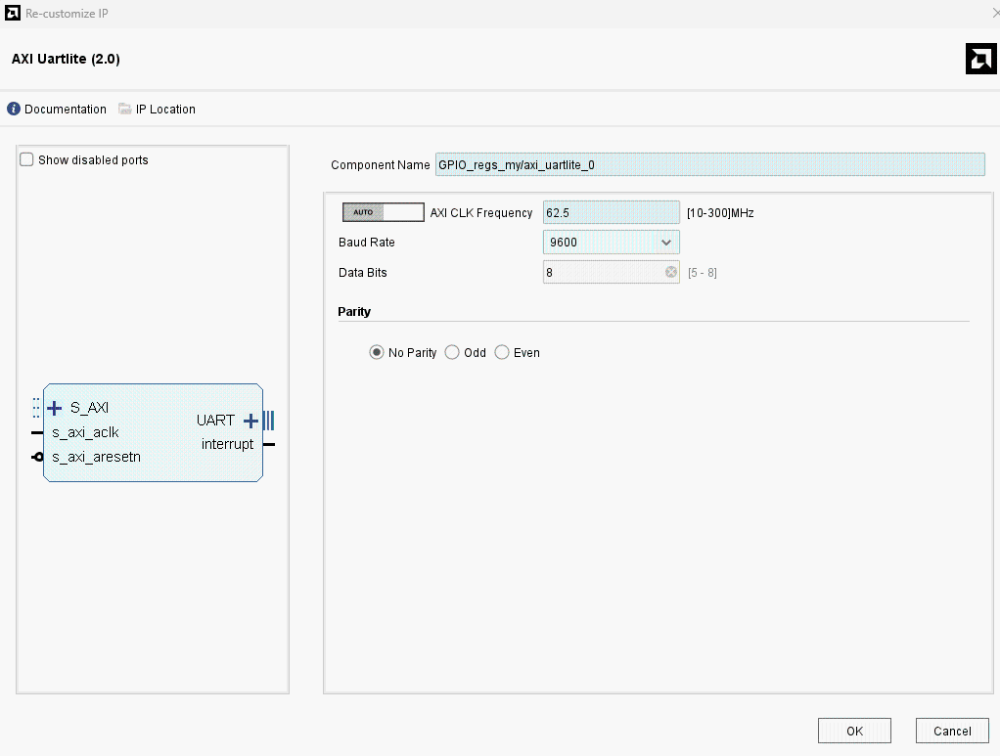

# Developing a UARTLite Driver over XDMA (PCIe) on a Custom SDR Board (Bridging AXI IP to Linux via PCIe)

## Abstract

This project demonstrates how to connect an FPGA-based UARTLite peripheral to Linux user-space applications through **PCIe** **XDMA**.  
I implement a **TTY interface** (Linux TTY driver) `/dev/ttyULx` and show an alternative **direct Python access** using `mmap`.  
Ideal for integration into **SDR**, robotics, and embedded systems!

- **What is the device?**  
  ➔ Our custom SDR board based on **FPGA Artix-7**, a **GPS SIM68** module, and an **AD9361** RF transceiver, featuring a PCIe interface for **FPGA–Linux** data exchange via **XDMA**.

- **What will we do?**  
  ➔ Develop a Linux driver for UARTLite over XDMA and demonstrate an alternative method for direct access via Python.

- **Why is this important?**  
  ➔ This solution enables easy integration of custom FPGA peripherals into Linux systems without complicated manual configuration, especially useful in SDR, robotics, autonomous systems, and IoT projects.

#### 1. Introduction

Embedded FPGA systems are widely used in **Software-Defined Radio (SDR)** applications.  
Effective communication between FPGA and CPU is critical but challenging when interfacing via PCIe.  
This article focuses on developing a driver for UARTLite over XDMA, showing two approaches: Linux kernel-space TTY and user-space direct access via Python.  
We aim to demonstrate the system architecture, driver implementation, and testing process on a custom SDR platform.

**Project highlights:**  
✅ **Custom-designed SDR board** with **FPGA Artix-7** and **AD9361**  
✅ **Host system:** **[Latte Panda Sigma](https://www.lattepanda.com/lattepanda-sigma)**  
✅ **Built-in UARTLite** connected to a **GPS SIM68** module  
✅ **High-speed data transfer** via **PCIe XDMA**  
✅ **Two operation modes:**

- **Linux TTY Driver interface** (`/dev/ttyULx`)

- **Direct Python access** via XDMA and `mmap`

## 2. System Architecture

### 2.0 Board and Connections Overview

The project is based on a fully custom SDR board with PCIe interface:


**Main components:**

| Component           | Description                                                     |
| ------------------- | --------------------------------------------------------------- |
| **FPGA**            | Xilinx Artix-7 (XC7A200T)                                       |
| **RF Transceiver**  | Analog Devices AD9361 (70 MHz – 6 GHz)                          |
| **GPS Module**      | SIM68 (NMEA 0183 Output)                                        |
| **DDR Memory**      | MT41K256M16HA-125 AAT                                           |
| **Host Board**      | [LattePanda Sigma](https://www.lattepanda.com/lattepanda-sigma) |
| **Interface**       | PCIe Gen1 x4 (10 Gbps via M.2 connector)                        |
| **Data Path**       | XDMA over AXI bus                                               |
| **UART Peripheral** | AXI UARTLite IP Core (9600 baud)                                |
| **Form Factor**     | M.2 2280 (80mm × 22mm)                                          |

###### 2.1 System Block Diagram

The diagram below illustrates the data flow chain between SIM68, UARTLite, XDMA, and the CPU:


**Data flow:**

1. **SIM68** transmits [NMEA](https://receiverhelp.trimble.com/alloy-gnss/en-us/NMEA-0183messages_MessageOverview.html) messages over **UART** to **UARTLite** inside FPGA.

2. **UARTLite** communicates with **XDMA (PCIe DMA)** via **AXI** bus.

3. **XDMA** sends the data through **PCIe** to the **CPU (LattePanda Sigma)**.

4. **CPU** processes the data in **user-space**, communicating with the **Linux kernel**.

5. **Linux Kernel** exposes a **TTY device or Python API** (`/dev/ttyUL0`).

6. **User Application** interacts with the UART either via Python scripts or terminal.

The second diagram shows **direct Python access** via XDMA without using the Linux driver:


<!-- или подставишь своё актуальное изображение для Python-потока -->

**Data flow:**

1. **SIM68** transmits NMEA messages over **UART** to **UARTLite** inside FPGA.

2. **UARTLite** connects to **XDMA** over the AXI bus.

3. **XDMA** transfers data over PCIe to the **CPU**.

4. **CPU** maps `/dev/xdma0_user` into memory using **mmap**.

5. **Python Application** directly accesses the UARTLite registers (RX FIFO / TX FIFO), bypassing the Linux kernel driver.

**Thus**, the interaction occurs without using the standard Linux TTY driver, which allows:

- Minimizing system call overhead.

- Reducing CPU load by utilizing **async IO**.

- Rapidly prototyping and debugging FPGA-based systems.

#### System Description

The system consists of the following components and their interconnections:

1. **SIM68 (GPS Module)**
   
   - A GPS module that sends data over a UART interface.
   
   - Connected to the **UartLite (UART Controller)** via **UART**.

2. **UartLite (UART Controller)**
   
   - A UART controller that receives data from the GPS module.
   
   - Connected to **XDMA (PCIe DMA)** via the **AXI** bus.
   
   - [AXI UARTLite Product Guide (PG142)](https://docs.amd.com/v/u/en-US/pg142-axi-uartlite)
   
   - [AXI Interconnect Product Guide (PG059)](https://docs.amd.com/r/en-US/pg059-axi-interconnect)

3. **XDMA (PCIe DMA)**
   
   - A direct memory access (DMA) controller over PCIe.
   
   - [AXI PCIe DMA Product Guide (PG195)](https://docs.amd.com/r/en-US/pg195-pcie-dma)
   
   - Connected to the **CPU (Latte Panda Sigma)** via **PCIe**.

4. **CPU (Latte Panda Sigma)**
   
   - The central processor that processes data received from XDMA.
   
   - Communicates with the **Linux Kernel** from the **User-space**.

5. **Linux Kernel**
   
   - The operating system kernel running on the CPU.
   
   - Provides interfaces for the **User Application** via **TTY / Python**.
   
   - [Linux TTY Documentation](https://docs.kernel.org/driver-api/tty/index.html)

6. **User Application**
   
   - A user-space application that interacts with the Linux Kernel to access the data, either through TTY devices or Python scripts.

This architecture demonstrates how the driver manages communication with the UARTLite module.

---

---

###### 2.2 Vivado Block Diagram

- The project uses **XDMA (PCIe DMA Bridge)**.

- **AXI Interconnect** connects XDMA, **AXI Register Slice**, and **AXI UARTLite**.

- **AXI UARTLite** is mapped into the system via AXI Interconnect.

- **AXI GPIO** blocks are also available for additional control.

**Primary data path:**  
**FPGA → AXI Interconnect → AXI UARTLite → XDMA → CPU/Linux**

*

Below is a screenshot of the Vivado project:


or a simpler implementation focused only on UartLite:


### 2.3 XDMA and UartLite Configuration:

AXI UARTLite (IP Settings):



**AXI UARTLite (IP Settings):**

- **AXI Clock Frequency:** `62.5 MHz`

- **UART Baud Rate:** `9600 baud`

- **Data Width:** `8 bits`

- **Parity:** `None (disabled)`

(For higher speeds, 115200 baud can be configured.)

#### XDMA (PCIe DMA Settings):

[AXI PCIe DMA Product Guide (PG195)]([AMD Technical Information Portal](https://docs.amd.com/r/en-US/pg195-pcie-dma))


- **Channels:**
  
  - 1 H2C (Host-to-Card)
  
  - 1 C2H (Card-to-Host)

- **Request IDs:** 32 (read), 16 (write)

- **AXI ID Width:** 4

- **Descriptor Bypass:** Disabled

- **BAR (Base Address Register):**
  
  - 1MB AXI Lite space mapped at `0x00000000`

- **Interrupts:**
  
  - MSI enabled
  
  - 16 interrupt vectors

- **Device Identifiers (PCIe ID)**
  
  - **Vendor ID:** `10EE` (Xilinx)
  
  - **Device ID:** `7011`
  
  - **Class Code:** `120000` 

#### PCIe Configuration:

[PCIe Base Specification (official summary)]([Specifications | PCI-SIG](https://pcisig.com/specifications))

- PCIe Gen1 x1 (2.5 GT/s)

- AXI Address Width: 64 bits

- AXI Data Width: 64 bits

- AXI Clock: 125 MHz

- Режим: AXI Memory Mapped

UartLite Memory Mapping (Example Setup):


#### 3. Driver Implementation

### 3.1 Setting Up the Environment

**Hardware Platform:**

- **SDR Board:** Custom-built, FPGA Artix-7 200T

- **GPS Module:** SIM68

- **Interfaces:** PCIe, UART

- **Motherboard:** LattePanda Sigma

**Software Stack:**

- **OS:** Linux Kernel 6.x+

- **Tools:** Vivado, Python, GCC

- **Debugging:** `dmesg`, `minicom`

### 3.2 Installing Dependencies

---
```shell
sudo apt-get update
sudo apt-get install -y build-essential dkms linux-headers-$(uname -r) git
sudo apt-get install -y pciutils lshw
sudo apt install -y gcc-13 g++-13 
sudo apt install -y gpsd gpsd-clients
```
---

**Packages explanation:**

- `build-essential` — GCC, Make, binutils (compiler toolchain)

- `dkms` — Dynamic Kernel Module Support

- `linux-headers-$(uname -r)` — Current kernel headers

- `git` — Git version control system

- `pciutils` (`lspci`) — Inspect PCIe devices

- `lshw` — Hardware information utility

- `gpsd`, `gpsd-clients` — GPS Daemon and utilities

**Check GCC version:**

---
```shell
gcc-13 --version
```
---

### 3.3 Hardware Check

Verify that the FPGA board is detected over PCIe:

---
```shell
lspci -d 10ee:
```
---

Expected output:

---
```bash
59:00.0 Memory controller: Xilinx Corporation Device 7011
```
---

### 3.4 Driver Implementation

#### Driver Working Principle

When the module is loaded, the driver registers the **PCIe device** with **Vendor ID** `0x10EE` and **Device ID** `0x7011`.  
It then creates a **TTY device** `/dev/ttyUL0`.

Incoming UARTLite data is processed via a **workqueue** and forwarded into the Linux TTY buffer (`tty_flip_buffer_push`), making it available for user-space applications.

👉 [Linux TTY Documentation](https://docs.kernel.org/driver-api/tty/index.html)

#### Important Constants

---
```c
#define DRIVER_NAME "uartlite_xdma" 
#define VENDOR_ID 0x10EE  // Xilinx Vendor ID
#define DEVICE_ID 0x7011  // Device ID  for FPGA Hard PCIe block
#define UARTLITE_BASE_OFFSET 0x40000 
```
---

- `VENDOR_ID` — Xilinx PCIe vendor ID

- `DEVICE_ID` — FPGA PCIe core device ID

- `UARTLITE_BASE_OFFSET` — UARTLite AXI address offset within XDMA space

#### UARTLite Register Offsets

(according to [AXI UARTLite Product Guide PG142](https://docs.amd.com/v/u/en-US/pg142-axi-uartlite))

---
```c
#define UARTLITE_RX_FIFO  0x00  
#define UARTLITE_TX_FIFO  0x04  
#define UARTLITE_STATUS   0x08  
#define UARTLITE_CONTROL  0x0C  
```
---

- **RX_FIFO:** Read received bytes

- **TX_FIFO:** Write bytes to transmit

- **STATUS:** Check FIFO status

- **CONTROL:** Control UARTLite behavior

#### Status Register Flags

---
```c
#define STATUS_RXVALID    BIT(0) // 1 -  RX data available
#define STATUS_TXFULL     BIT(3) // 1 - TX FIFO full
```
---

#### Core Driver Structure

---
```c
struct uartlite_priv {
    void __iomem *base;
    struct tty_port port;
    struct work_struct rx_work; // Обработчик RX (workqueue)
    bool running;
};
```
---

- `base`: Mapped address space (AXI base from XDMA)

- `port`: Linux TTY port structure

- `rx_work`: Workqueue for RX polling

- `running`: Flag to control polling

#### UARTLite Access Functions

**Check TX FIFO availability:**

---
```c
static int uartlite_tx_ready(struct uartlite_priv *priv)
{
    return !(ioread32(priv->base + UARTLITE_STATUS) & STATUS_TXFULL);
}
```
---

**Write a byte to UARTLite:**

---
```c
static void uartlite_write_byte(struct uartlite_priv *priv, u8 val)
{
    iowrite32(val, priv->base + UARTLITE_TX_FIFO);
}
```
---

**Check RX FIFO data availability:**

---
```c
static int uartlite_rx_ready(struct uartlite_priv *priv)
{
    return ioread32(priv->base + UARTLITE_STATUS) & STATUS_RXVALID;
}
```
---

**Read a byte from RX FIFO:**

---
```c
static u8 uartlite_read_byte(struct uartlite_priv *priv)
{
    return ioread32(priv->base + UARTLITE_RX_FIFO);
}
```
---

#### RX Workqueue: Polling UARTLite

In this driver, **RX FIFO polling** (polling the UARTLite receive buffer) is used through a **workqueue** to simplify the implementation and avoid using interrupt-driven mechanisms.

**Polling** is a method of data handling where the **CPU periodically checks the device's status** and reads data if it is available.

##### **How polling works in this driver:**

**1. The application opens the TTY device (`/dev/ttyUL0`)**

- The `uartlite_tty_open()` function is called, which **sets the `running = true` flag**.

- The `uartlite_rx_work()` handler is scheduled using `schedule_work()`.

**2. The `uartlite_rx_work()` function checks if there is data in the RX FIFO**

- **It reads the status register (`UARTLITE_STATUS`)**.

- If there is data in the `RX FIFO` (`STATUS_RXVALID` = `1`), it reads the data, buffers it, and pushes it into the TTY subsystem (`tty_flip_buffer_push`, `tty_insert_flip_string`).

**3. If the FIFO is not empty, the data is passed to the TTY subsystem**

- It calls:

---
```c
  tty_insert_flip_string(&priv->port, buf, count); 
  tty_flip_buffer_push(&priv->port);
```
---

- The data then becomes available through `/dev/ttyUL0`.

**4. After processing the data, `uartlite_rx_work()` re-schedules itself**

- **If `running = true`**, the function **re-schedules** itself (`schedule_work()`).

- **If `running = false`**, the process stops (for example, when `/dev/ttyUL0` is closed).

---
```c
static void uartlite_rx_work(struct work_struct *work)
{
  struct uartlite_priv *priv = container_of(work, struct uartlite_priv, rx_work);
    struct tty_struct *tty = tty_port_tty_get(&priv->port);
    unsigned char buf[16];
    int i, count;

    if (!tty)
        return;

    while (priv->running && uartlite_rx_ready(priv)) {
        count = 0;
        for (i = 0; i < sizeof(buf) && uartlite_rx_ready(priv); i++) {
            buf[i] = uartlite_read_byte(priv);
            count++;
        }
        if (count) {
            tty_insert_flip_string(&priv->port, buf, count);
            tty_flip_buffer_push(&priv->port);
        }
    }

    if (priv->running)
        schedule_work(&priv->rx_work);

    tty_kref_put(tty);
}
```
---

#### PCIe Device Registration

The PCIe driver is registered with the following structure:

---
```c
static struct pci_driver uartlite_pci_driver = {
    .name = DRIVER_NAME,
    .id_table = uartlite_pci_tbl,
    .probe = uartlite_probe,
    .remove = uartlite_remove,
};
```
---

- When the device is detected → **the `uartlite_probe()` function is called**.

- When the device is removed → **the `uartlite_remove()` function is called**.

The code below defines the **PCI device ID table** supported by the driver:

---
```c
static const struct pci_device_id uartlite_pci_tbl[] = {
    { PCI_DEVICE(VENDOR_ID, DEVICE_ID) },
    { 0, }
};
```
---

- **`static const struct pci_device_id uartlite_pci_tbl[]`**
  
  - Defines the **`uartlite_pci_tbl` array**, which lists the supported PCIe devices.
  
  - It is used by the Linux kernel to match devices that the driver can manage.

- **`{ PCI_DEVICE(0x10EE, 0x7011) }`**
  
  - `PCI_DEVICE(vendor, device)` — a macro that creates a `pci_device_id` structure.
  
  - `0x10EE` — **Vendor ID** (Xilinx).
  
  - `0x7011` — **Device ID** (corresponding to the UARTLite device in this case).

- **`{ 0, }`**
  
  - A terminating element (zero identifier) that marks the end of the list.

If the system detects a device with **Vendor ID `0x10EE` and Device ID `0x7011`**, the driver’s **`probe()` function** will be called:

---
```c
static int uartlite_probe(struct pci_dev *pdev, const struct pci_device_id *ent)
```
---

The main tasks of `uartlite_probe()`:

- Allocate memory for the driver’s private structure (`uartlite_priv`).

- Configure access to PCIe resources (I/O addresses, registers).

- Register the UARTLite as a TTY device (`/dev/ttyUL0`).

- Set up a workqueue for handling received data.

#### Module Initialization

---
```c
module_init(uartlite_init);
module_exit(uartlite_exit);
```
---

</details>

</summary>

- `module_init(uartlite_init);` — defines the function that will be called when the module is loaded into the Linux kernel.

- `module_exit(uartlite_exit);` — defines the function that will be called when the module is removed from the kernel.

These macros are the standard way in Linux kernel modules to specify the entry and exit points.

### 3.5 Full Driver Code (`uartlite_xdma.c`)

---
```c
/*
 * UARTlite TTY Driver over XDMA
 *
 * Author: 
 * Date: 
 *
 * This driver enables communication with AXI UART Lite over PCIe XDMA.
 * It implements a TTY interface (ttyULx) for user-space interaction and supports
 * RX polling using a work queue mechanism.
 *
 * License: GPL v2
 */

 #include <linux/version.h>
#include <linux/module.h>
#include <linux/pci.h>
#include <linux/tty.h>
#include <linux/tty_driver.h>
#include <linux/tty_flip.h> // tty_insert_flip_string и tty_flip_buffer_push
#include <linux/io.h>
#include <linux/workqueue.h> // work_struct

// External information
#define DRIVER_NAME "uartlite_xdma" // Driver name
#define VENDOR_ID 0x10EE  // Xilinx Vendor ID
#define DEVICE_ID 0x7011  // Device ID for 7-Series FPGA Hard PCIe block
#define UARTLITE_BASE_OFFSET 0x40000 // AXI base address

// AXI UART Lite Register Offsets
#define UARTLITE_RX_FIFO  0x00  // Receive FIFO
#define UARTLITE_TX_FIFO  0x04  // Transmit FIFO
#define UARTLITE_STATUS   0x08  // Status register
#define UARTLITE_CONTROL  0x0C  // Control register

// Status Register Flags
#define STATUS_RXVALID    BIT(0) // Data available in RX FIFO
#define STATUS_TXFULL     BIT(3) // TX FIFO is full


struct uartlite_priv {
    void __iomem *base;
    struct tty_port port;
    struct work_struct rx_work; // Polling
    bool running;
};

static struct tty_driver *uartlite_tty_driver;

/* UART Lite Functions */
static int uartlite_tx_ready(struct uartlite_priv *priv)
{
    return !(ioread32(priv->base + UARTLITE_STATUS) & STATUS_TXFULL);
}

static void uartlite_write_byte(struct uartlite_priv *priv, u8 val)
{
    iowrite32(val, priv->base + UARTLITE_TX_FIFO);
}

static int uartlite_rx_ready(struct uartlite_priv *priv)
{
    return ioread32(priv->base + UARTLITE_STATUS) & STATUS_RXVALID;
}

static u8 uartlite_read_byte(struct uartlite_priv *priv)
{
    return ioread32(priv->base + UARTLITE_RX_FIFO);
}

/* Work function for polling RX FIFO */
static void uartlite_rx_work(struct work_struct *work)
{
    struct uartlite_priv *priv = container_of(work, struct uartlite_priv, rx_work);
    struct tty_struct *tty = tty_port_tty_get(&priv->port);
    unsigned char buf[16];
    int i, count;

    if (!tty)
        return;

    while (priv->running && uartlite_rx_ready(priv)) {
        count = 0;
        for (i = 0; i < sizeof(buf) && uartlite_rx_ready(priv); i++) {
            buf[i] = uartlite_read_byte(priv);
            count++;
        }
        if (count) {
            tty_insert_flip_string(&priv->port, buf, count);
            tty_flip_buffer_push(&priv->port);
        }
    }

    if (priv->running)
        schedule_work(&priv->rx_work);

    tty_kref_put(tty);
}

/* TTY Operations */
static int uartlite_tty_open(struct tty_struct *tty, struct file *filp)
{
    struct uartlite_priv *priv = container_of(tty->port, struct uartlite_priv, port);
    priv->running = true;
    schedule_work(&priv->rx_work);
    return tty_port_open(tty->port, tty, filp);
}

static void uartlite_tty_close(struct tty_struct *tty, struct file *filp)
{
    struct uartlite_priv *priv = container_of(tty->port, struct uartlite_priv, port);
    priv->running = false;
    cancel_work_sync(&priv->rx_work);
    tty_port_close(tty->port, tty, filp);
}


#if LINUX_VERSION_CODE <= KERNEL_VERSION(6, 5, 0)
static int uartlite_tty_write(struct tty_struct *tty, const unsigned char *buf, int count)
#else
static ssize_t uartlite_tty_write(struct tty_struct *tty, const u8 *buf, size_t count)
#endif
{
    struct uartlite_priv *priv = tty->driver_data;
    int i;

    for (i = 0; i < count; i++) {
        while (!uartlite_tx_ready(priv))
            cpu_relax();
        uartlite_write_byte(priv, buf[i]);
    }
    return i;
}


static unsigned int uartlite_tty_write_room(struct tty_struct *tty)
{
    struct uartlite_priv *priv = tty->driver_data;
    return uartlite_tx_ready(priv) ? 16 : 0;
}

static unsigned int uartlite_tty_chars_in_buffer(struct tty_struct *tty)
{
    return 0;
}

static const struct tty_operations uartlite_tty_ops = {
    .open = uartlite_tty_open,
    .close = uartlite_tty_close,
    .write = uartlite_tty_write,
    .write_room = uartlite_tty_write_room,
    .chars_in_buffer = uartlite_tty_chars_in_buffer,
};

/* TTY Port Initialization */
static int uartlite_port_activate(struct tty_port *port, struct tty_struct *tty)
{
    struct uartlite_priv *priv = container_of(port, struct uartlite_priv, port);
    tty->driver_data = priv;
    return 0;
}

static void uartlite_port_shutdown(struct tty_port *port)
{
    struct uartlite_priv *priv = container_of(port, struct uartlite_priv, port);
    priv->running = false;
    cancel_work_sync(&priv->rx_work);
}

static const struct tty_port_operations uartlite_port_ops = {
    .activate = uartlite_port_activate,
    .shutdown = uartlite_port_shutdown,
};

/* PCI Probe Function */
static int uartlite_probe(struct pci_dev *pdev, const struct pci_device_id *ent)
{
    struct uartlite_priv *priv;
    int ret;

    priv = devm_kzalloc(&pdev->dev, sizeof(*priv), GFP_KERNEL);
    if (!priv)
        return -ENOMEM;

    ret = pcim_enable_device(pdev);
    if (ret)
        return ret;

    priv->base = pcim_iomap(pdev, 0, 0);
    if (!priv->base)
        return -ENOMEM;

    priv->base += UARTLITE_BASE_OFFSET;

    tty_port_init(&priv->port);
    priv->port.ops = &uartlite_port_ops;
    INIT_WORK(&priv->rx_work, uartlite_rx_work);
    priv->running = false;

    tty_port_register_device(&priv->port, uartlite_tty_driver, 0, &pdev->dev);

    pci_set_drvdata(pdev, priv);
    dev_info(&pdev->dev, "UARTlite over XDMA registered as TTY");
    return 0;
}

static void uartlite_remove(struct pci_dev *pdev)
{
    struct uartlite_priv *priv = pci_get_drvdata(pdev);
    tty_unregister_device(uartlite_tty_driver, 0);
    tty_port_destroy(&priv->port);
}

static const struct pci_device_id uartlite_pci_tbl[] = {
    { PCI_DEVICE(VENDOR_ID, DEVICE_ID) },
    { 0, }
};

static struct pci_driver uartlite_pci_driver = {


    .name = DRIVER_NAME,
    .id_table = uartlite_pci_tbl,
    .probe = uartlite_probe,
    .remove = uartlite_remove,
};

/* Module Initialization */
static int __init uartlite_init(void)
{
    int ret;

    uartlite_tty_driver = tty_alloc_driver(1, TTY_DRIVER_REAL_RAW | TTY_DRIVER_DYNAMIC_DEV);
    if (IS_ERR(uartlite_tty_driver))
        return PTR_ERR(uartlite_tty_driver);

    uartlite_tty_driver->driver_name = DRIVER_NAME;
    uartlite_tty_driver->name = "ttyUL";
    uartlite_tty_driver->major = 0;
    uartlite_tty_driver->minor_start = 0;
    uartlite_tty_driver->type = TTY_DRIVER_TYPE_SERIAL;
    uartlite_tty_driver->subtype = SERIAL_TYPE_NORMAL;
    uartlite_tty_driver->init_termios = tty_std_termios;
    uartlite_tty_driver->init_termios.c_cflag = B9600 | CS8 | CREAD | HUPCL | CLOCAL;

    tty_set_operations(uartlite_tty_driver, &uartlite_tty_ops);

    ret = tty_register_driver(uartlite_tty_driver);
    if (ret) {
        tty_driver_kref_put(uartlite_tty_driver);
        return ret;
    }

    ret = pci_register_driver(&uartlite_pci_driver);
    if (ret) {
        tty_unregister_driver(uartlite_tty_driver);
        tty_driver_kref_put(uartlite_tty_driver);
    }

    return ret;
}

static void __exit uartlite_exit(void)
{
    pci_unregister_driver(&uartlite_pci_driver);
    tty_unregister_driver(uartlite_tty_driver);
    tty_driver_kref_put(uartlite_tty_driver);
}

module_init(uartlite_init);
module_exit(uartlite_exit);

MODULE_LICENSE("GPL v2");
MODULE_AUTHOR("Konstantin");
MODULE_DESCRIPTION("UARTlite TTY driver over XDMA with RX support");
```
---

### 3.6 Building, Testing, and Debugging

Before building the driver, make sure that the Linux kernel headers are installed:

---
```shell
sudo apt update
sudo apt install -y linux-headers-$(uname -r)
```
---

To verify:

---
```shell
ls /lib/modules/$(uname -r)/build
```
---

If the directory exists, the headers are installed correctly.

#### Building the Driver

Below is the `Makefile` used to build the driver:

---
```makefile
# Build the kernel module
obj-m += uartlite_xdma.o

# Kernel build directory (default: current running kernel)
KDIR ?= /lib/modules/$(shell uname -r)/build

# Build the module
all:
    make CC=/usr/bin/gcc-13 -C $(KDIR) M=$(PWD) modules

# Clean up compiled files
clean:
    make -C $(KDIR) M=$(PWD) clean

# Install the module into the system
install:
    make -C $(KDIR) M=$(PWD) modules_install

# Enable debugging symbols (-g flag for debugging)
EXTRA_CFLAGS += -g

# Define targets that are not actual files
.PHONY: all clean install
```
---

Run the build command:

---
```sh
make
```
---

After a successful build, a file named **`uartlite_xdma.ko`** will appear — this is the ready-to-use kernel module.

Expected output:


To verify:

---
```shell
ls -l uartlite_xdma.ko
```
---

Expected output example:

---
```bash
-rwxr-xr-x 1 nvx root 390152 Mar 13 18:15 uartlite_xdma.ko
```
---

#### Loading the Driver

Load the driver into the kernel and verify that it is loaded:

---
```shell
sudo insmod uartlite_xdma.ko
lsmod | grep uartlite_xdma
```
---

If successful, it should appear in the module list:

---
```bash
uartlite_xdma          12288  0
```
---

View driver logs:

---
```shell
sudo dmesg | tail -n 20
```
---

Example output:


Check for the TTY device:

---
```shell
ls /dev/ttyUL*
```
---

Example output:

---
```shell
/dev/ttyUL0
```
---

#### Testing the Driver

To check the functionality:

---
```shell
sudo minicom -D /dev/ttyUL0 
```
---

Expected NMEA output:

---
```shell
$GPGGA,123456.78,5540.1234,N,03734.5678,E,1,08,0.9,100.0,M,0.0,M,,*47
```
---

Example output without a GPS antenna connected:


You can also connect the TTY device to `gpsd`:

Start `gpsd` and bind it to `/dev/ttyUL0`:

---
```shell
sudo gpsd /dev/ttyUL0 -F /var/run/gpsd.sock
```
---

- `/dev/ttyUL0` — the UART device connected to the GPS module

- `-F /var/run/gpsd.sock` — creates a UNIX socket for GPS applications

Or:

---
```shell
sudo gpsd -N -D3 -F /var/run/gpsd.sock /dev/ttyUL0
```
---

- `-N` — prevents gpsd from daemonizing (good for debugging)

- `-D3` — sets debug verbosity

- `/dev/ttyUL0` — UART device to use

Check if `gpsd` is running:

---
```shell
ps aux | grep gpsd
```
---

Expected output:

---
```bash
root         7131  0.0  0.0   9084  2432 pts/3    S+   18:51   0:00 grep --color=auto gpsd
```
---

Run `cgps` to see live GPS data:

---
```shell
cgps -s
```
---

Example output (when GPS is locked):

---
```yaml
Time: 2025-03-13T12:34:56Z 
Latitude: 55.7558 N 
Longitude: 37.6173 E 
Speed: 0.5 km/h 
Altitude: 200 m
```
---

Check raw NMEA data from the GPS:

---
```shell
gpspipe -r
```
---

Example output:

---
```mathematica
$GPGGA,123456.00,5537.348,N,03736.882,E,1,08,1.0,200.0,M,0.0,M,,*47 
$GPRMC,123456.00,A,5537.348,N,03736.882,E,0.5,45.0,130324,,,A*7C
```
---

#### Unloading the Driver

 To remove the module:

---
```shell
sudo rmmod uartlite_xdma
```
---

To clean up the build files:

---
```shell
make clean
```
---

## 5. Working with UARTLite via XDMA in Python

Besides using the Linux driver, you can **work directly with UARTLite via XDMA** using **Python**.  
This approach is useful for debugging, quick testing, or safely implementing functionality in userspace.

### 5.1 Building the XDMA Driver

Before using **XDMA**, you need to **compile and install the driver**.  
The **XDMA** driver is provided by Xilinx and supports working with PCIe devices implementing DMA.  
👉 [XDMA Linux Kernel Drivers GitHub](https://github.com/Xilinx/dma_ip_drivers)

### 5.2 Cloning XDMA Driver Source Code

The driver sources are available in the official Xilinx repository:

---
```sh
git clone https://github.com/Xilinx/dma_ip_drivers.git
cd dma_ip_drivers/XDMA/linux-kernel###
```
---

### 5.3 Compiling the Driver

Before building, make sure you have the Linux kernel headers installed:

---
```shell
sudo apt-get install linux-headers-$(uname -r)
```
---

Then compile the driver:

---
```shell
make
```
---

Example output:


### 5.4 Installing and Loading the Driver

---
```shell
sudo make install
sudo modprobe xdma
```
---

Example output:


If this approach doesn't work, you can alternatively load the driver manually:

---
```shell
cd dma_ip_drivers/XDMA/linux-kernel/tests/
sudo ./load_driver.sh 
```
---

Expected output:

---
```shell
interrupt_selection .
xdma                   24576  0
Loading driver...insmod xdma.ko interrupt_mode=2 ...

The Kernel module installed correctly and the xmda devices were recognized.
DONE
```
---

Verify that the module is loaded:

---
```shell
lsmod | grep xdma
```
---

Expected output:

---
```bash
xdma                  110592  0
```
---

After installing the driver, new device files should appear:

---
```shell
ls /dev/xdma*
```
---

Expected output:

---
```bash
/dev/xdma0_c2h_0  /dev/xdma0_h2c_0  /dev/xdma0_control  /dev/xdma0_user
```
---

If these files are present, the driver is successfully installed, and XDMA is ready to use.  
Now you can proceed to testing UARTLite.

Example view on my setup:


| Device File                                    | Description                                                                                   |
| ---------------------------------------------- | --------------------------------------------------------------------------------------------- |
| `/dev/xdma0_c2h_0`                             | C2H (Card-to-Host) — transfer data from FPGA to CPU                                           |
| `/dev/xdma0_h2c_0`                             | H2C (Host-to-Card) — transfer data from CPU to FPGA                                           |
| `/dev/xdma0_user`                              | User control interface (for custom FPGA access)                                               |
| `/dev/xdma0_xvc`                               | **Xilinx Virtual Cable (XVC)** — enables JTAG-over-PCIe (`telnet localhost 2542` for testing) |
| `/dev/xdma0_control`                           | XDMA Control Register                                                                         |
| `/dev/xdma0_events_0`...`/dev/xdma0_events_15` | Event files for FPGA-to-CPU interrupt signaling                                               |

- **The DMA driver is loaded** and created the necessary `/dev/` entries.

- You can **read/write** data through `c2h_0` (FPGA → CPU) and `h2c_0` (CPU → FPGA).

- **Interrupts** can be monitored through `xdma_events_*`.

- **XVC** allows working with **JTAG over PCIe**.

### 5.5 Python Code for UARTLite Access via XDMA (`uaxdma.py`)

**Overview of the Python Code:**  
The script opens the `/dev/xdma0_user` device, mapping **XDMA** memory into the process address space using `mmap`.  
It then accesses **UARTLite** registers at offset `0x40000`, reading from **RX FIFO** and writing to **TX FIFO**.  
This allows direct interaction with **UARTLite** without needing a kernel driver.

---
```python
import os
import time
import numpy as np
import mmap
import asyncio

# ============================ #
#  XDMA + UARTLite (Unified)
# ============================ #
class XdmaUartLite:
    BASE_ADDR = 0x40000  ## Base address of UARTLite in XDMA

    # UARTLite Register Offsets
    RX_FIFO = 0x00
    TX_FIFO = 0x04
    STATUS = 0x08
    CONTROL = 0x0C

    # Флаги
    TX_FULL = 0x08
    RX_VALID = 0x01
    TX_RESET = 0x01
    RX_RESET = 0x02

    def __init__(self, device_index=0):
        """Initialize XDMA and UARTLite"""
        base = f"/dev/xdma{device_index}"

        # Open file for XDMA user space access
        self.fd_user = os.open(f"{base}_user", os.O_RDWR)

        # Create memory mapping for fast register access
        self.m_rmap = np.frombuffer(mmap.mmap(self.fd_user, int(1e6)), np.uint32)

        # Reset UARTLite FIFOs
        self.reset_fifos()

    def close(self):
        """Close XDMA file descriptors"""
        os.close(self.fd_user)


    # ============================ #
    #  XDMA Read/Write Access
    # ============================ #
    def read_reg(self, addr):
         """Read a 32-bit value from a register"""
        return self.m_rmap[addr >> 2] & 0xFFFF

    def write_reg(self, addr, data):
        """Write a 32-bit value to a register"""
        self.m_rmap[addr >> 2] = np.uint32(data)

    # ============================ #
    #  UARTLite Operations
    # ============================ #
    def reset_fifos(self):
        """Reset TX and RX FIFOs"""
        self.write_reg(self.BASE_ADDR + self.CONTROL, self.TX_RESET | self.RX_RESET)

    def send_byte(self, data):
        """Send a single byte via UARTLite"""
        while self.read_reg(self.BASE_ADDR + self.STATUS) & self.TX_FULL:
            pass  # Wait for TX FIFO to become available
        self.write_reg(self.BASE_ADDR + self.TX_FIFO, data)

    def recv_byte(self):
        """Receive a single byte via UARTLite"""
        while not (self.read_reg(self.BASE_ADDR + self.STATUS) & self.RX_VALID):
            pass  # Wait for data in RX FIFO
        return self.read_reg(self.BASE_ADDR + self.RX_FIFO)

    def send_data(self, data):
        """Send an array of bytes via UARTLite"""
        for byte in data:
            self.send_byte(byte)

    def recv_data(self, size):
        """Receive an array of bytes via UARTLite"""
        return bytearray([self.recv_byte() for _ in range(size)])

    async def recv_byte_async(self):
        """Asynchronously receive a single byte."""
        while not (self.read_reg(self.BASE_ADDR + self.STATUS) & self.RX_VALID):
            await asyncio.sleep(0.001)  # Дадим CPU отдохнуть, чтобы не нагружать 100%
        return self.read_reg(self.BASE_ADDR + self.RX_FIFO)

    async def recv_data_async(self, size):
        """Asynchronously receive an array of bytes."""
        return bytearray([await self.recv_byte_async() for _ in range(size)])

# ============================ #
#  Testing XDMA + UARTLite
# ============================ #

### Simple polling version
# if __name__ == "__main__":
#     xdma_uart = XdmaUartLite(device_index=0)
#     print("Waiting for data from UARTLite...")
#     while True:
#         data = xdma_uart.recv_data(128)
#         if data:
#             print(data.decode(errors="ignore").strip())

### Async version
async def main():
    uart = XdmaUartLite()
    while True:
        data = await uart.recv_data_async(128)
        print(data.decode(errors="ignore"))

asyncio.run(main())
```
---

To run it:

---
```shell
sudo python3 uaxdma.py
```
---

Example output:


### 5.6 Performance Profiling

Performance analysis of `uaxdma.py` using `py-spy` for the async implementation:

without the async implementation:

**CPU Load**

- **Polling (second screenshot):** **100% CPU usage**, with `read_reg` consuming **93% of the time**.

- **Async version (first screenshot):** **1% CPU usage**, with `read_reg` having almost no impact on the system.

**Function Execution Time**

- **Polling:** `read_reg` takes **8.7s out of 8.7s**, meaning the program is almost entirely busy checking for data.

- **Async:** `read_reg` runs for only **0.01s**, while most of the time is spent in `asyncio.sleep()`, significantly reducing CPU load.

**Number of Calls**

- In the **polling version**, `recv_byte` is called **very frequently**, heavily loading the CPU.

- In the **async version**, `recv_byte` is called **much less often** because the code "waits" for data instead of constantly polling.

## 6. Conclusions

The developed solutions provide stable data transmission from the **GPS** module through **UARTlite** to the application, simplifying the integration of **FPGA** peripherals into **SDR** systems.  
Using interrupts instead of `polling` can significantly reduce **CPU** load, while optimizing buffering can increase throughput.  
This makes the solution suitable for a wide range of **SDR** projects, from prototyping to industrial applications.

This project implements **two approaches for working with UARTlite via XDMA**:

1. **A classic Linux driver with a TTY interface**, allowing the device to be used as a standard `UART`.

2. **Direct access via Python**, enabling application development without writing a kernel driver and allowing safer debugging compared to kernel-space development.

### Advantages of the solution:

- Support for standard Linux TTY devices.

- Ability to work through Python without a custom driver.

### Possible improvements:

- Add interrupt-based support instead of **polling**.

Developing a **Linux driver** and working with **XDMA via Python** enables efficient use of `UARTlite` and other IP cores in projects.

🚀 **If you are interested in the topic of designing a custom SDR board (PCB development, SI/PI analysis, RF part analysis, etc.) and writing drivers, I'm ready to create a full series of articles on building an SDR device!**

## 📚 Additional Resources

- [UARTLite XDMA Driver GitHub Repository](https://github.com/MarsWise/uartlie_xdma)
- [AXI UARTLite Product Guide (PG142)](https://www.xilinx.com/support/documentation/ip_documentation/axi_uartlite/v2_0/pg142-axi-uartlite.pdf)
- [XDMA PCIe DMA Product Guide (PG195)](https://www.xilinx.com/support/documentation/ip_documentation/xdma/v4_1/pg195-pcie-dma.pdf)
- [Xilinx dma_ip_drivers GitHub](https://github.com/Xilinx/dma_ip_drivers)
- [Linux TTY Subsystem Documentation](https://www.kernel.org/doc/html/latest/driver-api/tty.html)
- [SIM68 GPS Module Datasheet](https://www.simcom.com/product/SIM68.html)
- [PCIe Specification Overview](https://pcisig.com/specifications/pciexpress/specifications)
